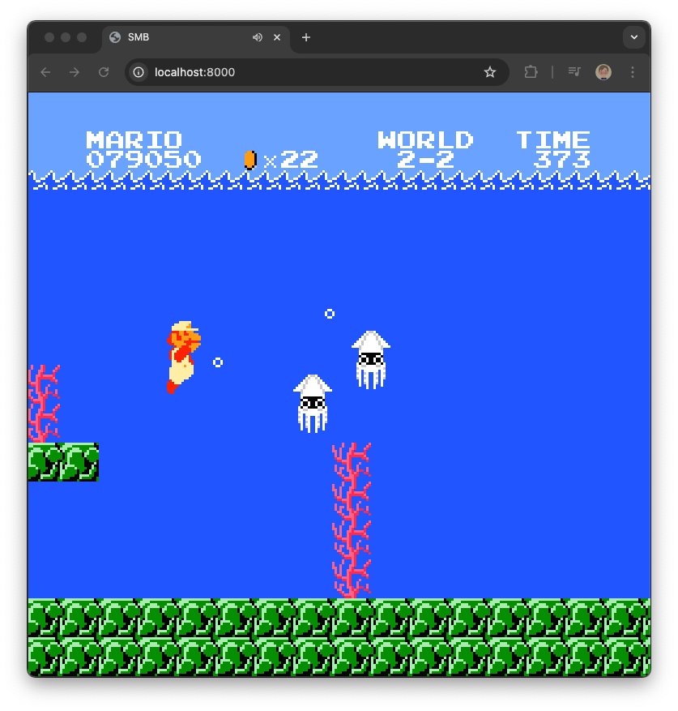

# SMB

[Play it online](https://nathsou.github.io/smb/)

Static recompilation of Super Mario Bros. using [doppelganger's disassembly](https://www.romhacking.net/documents/344/)

## Controls

- D-Pad: WASD
- B: K
- A: L
- start: Enter
- select: Space
- z: Save state
- x: Load state

## Checkpoints

- [x] Static translation of the disassembly to low-level C
- [x] PPU & APU emulation layers
- [x] Convert subroutines to C functions
- [ ] Remove unused flag updates
- [ ] Replace PPU with direct draw calls
- [ ] Manually rewrite portions of the code to higher level C

## Building

### Linux & MacOS

In the root folder:

1. Clone and build raylib using [raylib-quickstart](https://github.com/raylib-extras/raylib-quickstart)
2. Run `make build`
3. Place a legally obtained dump/ROM of SMB called `Super Mario Bros.nes` in the root folder to extract graphics data from
4. You can now run `./smb`

## WebAssembly

1. Install a recent version of `clang` with support for the `wasm32` target
2. Run `make wasm`
3. Run an HTTP server in the `web/` folder and open `index.html` in your browser
4. Select a legally obtained dump/ROM of SMB to extract graphics data from

## References & Resources

- [doppelganger's disassembly](https://www.romhacking.net/documents/344/)
- [SuperMarioBros-C by MitchellSternke](https://github.com/MitchellSternke/SuperMarioBros-C)
- [Nesdev Wiki](https://www.nesdev.org/wiki/Nesdev_Wiki)
- [nessy](https://github.com/nathsou/nessy)
- [An Overview of NES Rendering by Austin Morlan](https://austinmorlan.com/posts/nes_rendering_overview/)
