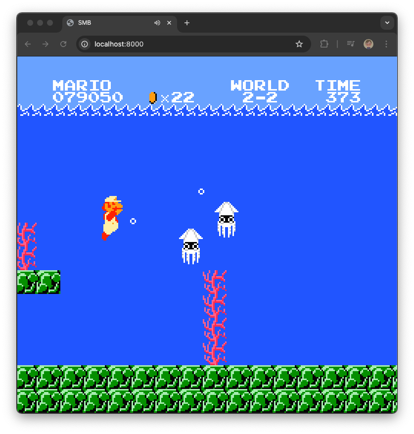

# SMB

[Play it online](https://nathsou.github.io/smb/)

Static recompilation of Super Mario Bros. using [doppelganger's disassembly](https://www.romhacking.net/documents/344/)

[](https://nathsou.github.io/smb)

## Controls

- D-Pad: WASD
- B: K
- A: L
- start: Enter
- select: Space
- z: Save state
- x: Load state

## Checkpoints

- [x] Static translation of the disassembly to low-level C
- [x] PPU & APU emulation layers
- [x] Convert subroutines to C functions
- [x] Convert most gotos to if statements
- [x] Remove unused flag updates
- [ ] Replace PPU with direct draw calls
- [ ] Manually rewrite portions of the code to higher level C

## Building

### Linux & MacOS

1. Fetch the submodules:
```bash
$ git submodule update --init --recursive
```

2. Build raylib, follow the instructions [here](https://github.com/raylib-extras/raylib-quickstart)

3. Run `make build` in the root folder:
```bash
$ make build
```

4. Place a legally obtained dump/ROM of SMB called `smb.nes` in the root folder to extract graphics data from
5. You can now run `./smb`

## WebAssembly

1. Install a recent version of `clang` with support for the `wasm32` target
2. Run `make wasm`
3. Run an HTTP server in the `web/` folder and open `index.html` in your browser
4. Select a legally obtained dump/ROM of SMB to extract graphics data from

## Codegen

The output of the code generator is in the `codegen/` folder. To regenerate it:

1. Install [Moonbit](https://www.moonbitlang.com/):

```bash
$ curl -fsSL https://cli.moonbitlang.com/install/unix.sh | bash -s '0.10.9+6e6c44045'
```

2. Run `make codegen`

The generator accepts the original, unmodified disassembly. It assembles an
original-address PRG image, recovers reachable instructions and callable regions,
and emits structured C with the source comments. See the
[analysis and migration notes](docs/recompiler-migration.md) for techniques,
validation, and current NROM limitations.

Run `python3 tests/check_codegen.py` for the ROM-free regression suite, or append
`--rom` with a local `smb.nes` to compare PRG bytes and replay the recorded 7,987
frames. These checks do not require Raylib.

To compile another compatible assembly input into a separate directory:

```bash
moon run src/main -- --input tests/nrom128.asm --output /tmp/nrom-codegen
```

## References & Resources

- [doppelganger's disassembly](https://www.romhacking.net/documents/344/)
- [SuperMarioBros-C by MitchellSternke](https://github.com/MitchellSternke/SuperMarioBros-C)
- [Nesdev Wiki](https://www.nesdev.org/wiki/Nesdev_Wiki)
- [nessy](https://github.com/nathsou/nessy)
- [An Overview of NES Rendering by Austin Morlan](https://austinmorlan.com/posts/nes_rendering_overview/)
